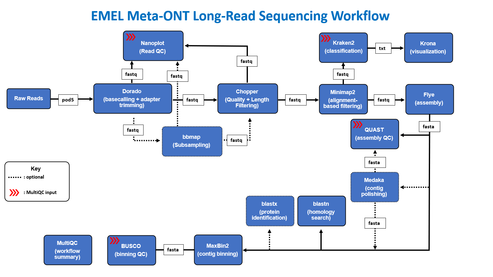
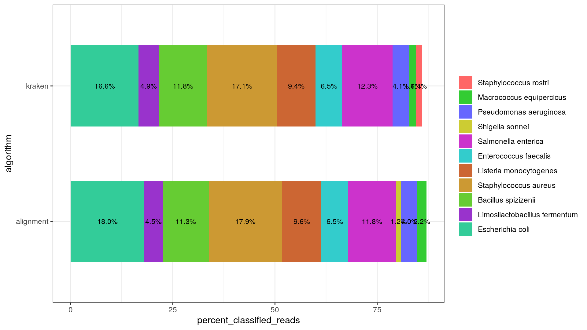

## Meta-ONT Workflow Diagram


## Summary

**Meta-ONT** is a bioinformatics workflow that accepts ONT reads as input and runs them through the following processes:

1. _OPTIONAL_: Subsampling ([`BBMap`](https://github.com/BioInfoTools/BBMap))

2. Long read QC 
     - Read Statistics/Summary ([`Nanoplot`](https://github.com/wdecoster/NanoPlot))
     - _OPTIONAL_: Adapter trimming ([`Porechop`](https://github.com/rrwick/Porechop))
     - Quality and Length Filtering ([`Chopper`](https://github.com/wdecoster/chopper))

3. Read Alignment ([`minimap2`](https://github.com/lh3/minimap2))

4. Alignment based filtering ([`samtools`](https://www.htslib.org/doc/samtools.html)) plus custom scripts

5. Taxonomic Classification ([`Kraken2`](https://github.com/DerrickWood/kraken2/blob/master/docs/MANUAL.markdown))

6. Taxonomic Distribution Visualization ([`Krona`](https://github.com/marbl/Krona/wiki))

7. Assembly with one of 3 tools:

     - [`Flye`](https://github.com/fenderglass/Flye)

     - [`Megahit`](https://github.com/voutcn/megahit)

     - [`Spades`](https://github.com/ablab/spades) - NOTE: Spades assembler should only be used with long reads when performing a hybrid assembly

8. Assembly QC ([`quast`](https://github.com/ablab/quast))

9. _OPTIONAL_: Assembly polishing ([`Medaka`](https://github.com/nanoporetech/medaka))

10. _OPTIONAL_: Polished assembly QC ([`quast`](https://github.com/ablab/quast))

11. Binning ([`Maxbin2`](https://sourceforge.net/projects/maxbin2/))

12. Contig alignment and identification ([`blast`](https://www.ncbi.nlm.nih.gov/books/NBK279684/))

13. Contig translation (Nucl -> AA) and protein identification ([`blastx`](https://www.ncbi.nlm.nih.gov/books/NBK279684/))

14. Workflow Summary ([`MultiQC`](https://github.com/MultiQC/MultiQC))


## Setup

This workflow uses assets and depencies native to the CDC's SciComp environment. If you do not have access to the SciComp environment, you can request an account [`here`](https://info.biotech.cdc.gov/info/helpdesk-ticket/?category=Account%20Requests). 


## Usage

First, prepare a samplesheet with your input data that looks as follows:

`samplesheet.csv`:

```csv
sample,fastq_long
SAMPLE_1,/scicomp/groups-pure/OID/NCEZID/DFWED/WDPB/EMEL/long-reads/sample1-long-read-ont.fastq.gz
SAMPLE_2,/scicomp/groups-pure/OID/NCEZID/DFWED/WDPB/EMEL/long-reads/sample2-long-read-ont.fastq.gz
```

The top row is the header row ("sample,fastq_long") and should never be altered. Each row below the header, represents a fastq file with a unique identifier in the "sample" column (SAMPLE_1 and SAMPLE_2 in the example above). Each fastq file needs to be gzipped/compressed to prevent validation errors from occuring at the initialization of the pipeline

There is an example samplesheet located under the assets folder (`assets/samplesheet.csv`) that you can view and edit yourself. **NOTE** If you use this samplesheet, please make a back up copy of it as it will be overwritten each time you pull an updated version of this repository. 

Once the samplesheet has been formatted, we can run the workflow using one of the 3 methods methods listed below.


**Method 1: Cluster Submission**:

The `qsub` method allows you to submit the job to SciComp's high memory cluster computing nodes for fast performance and load distribution. This is a good "fire and forget" method for new users who aren't as familiar with SciComp's compute environment

Format:
```bash
bash ./run_qsub.sh --input "/path/to/samplesheet" --outdir "/path/to/output/directory" "<additional-parameters>"
```

Example:
```bash
bash ./run_qsub.sh --input "assets/samplesheet.csv" --outdir "results/test" "--skip_subsample false --num_subsamples 1000 --skip_kraken2 false"
```


**Method 2: Local Execution**:

The `local` method may be a better option if you are experiencing technical issues with the `qsub` method. `qsub` adds additonal layers of complexity to workflow execution, while `local` simply runs the workflow on your local machine or the host that you're connected to, _**provided it has sufficient memory/RAM and CPUs to execute the workflow**_

Format:
```bash
bash ./run_local.sh --input "/path/to/samplesheet" --outdir "/path/to/output/directory" "<additional-parameters>"
```

Example:
```bash
bash ./run_local.sh --input "./assets/samplesheet.csv" --outdir "./results/test" "--skip_subsample false --num_subsamples 1000 --skip_kraken2 false"
```


**Method 3: Native Nextflow Execution**:

If you are familiar with nextflow and Scicomp's computing environment, you can invoke the `nextflow` command straight from the terminal. **NOTE: if you are using this method you will need to load up a nextflow environment via `module load` or `conda`**
 
Format:
```bash
nextflow run main.nf -profile singularity,local --input "/path/to/samplesheet" --outdir "/path/to/output/directory" \<additional flags\>
```

Example:
```bash
nextflow run main.nf -profile singularity,local --input "./assets/samplesheet.csv" --outdir "./results/test" --skip_subsample false --num_subsamples 1000 --skip_kraken2 false
```

## Update: Sample barplot from classification comparison module

The following barplot was generated using my new classification comparison module which is intended to plot the top 10 classification hits from alignment-based classification and kraken2 classification. The data used to generate this graph was a 10,000 read subsample from a ZYMO mock community sample:




## Parameters

See below for all possible input parameters:


**Global Variables**:
| Parameter | Data Type | Default Value |
|:---------:|:---------:|:-------------:|
| `--metagenomic_sample` | boolean | true |


**Workflow processes**:
| Parameter | Data Type | Default Value |
|:---------:|:---------:|:-------------:|
| `--skip_subsample` | boolean | true |
| `--skip_porechop` | boolean | true |
| `--skip_metamaps` | boolean | true |
| `--skip_nonpareil` | boolean | true |
| `--skip_alignment_based_filtering` | boolean | true |
| `--skip_fastq_screen` | boolean | true |
| `--skip_kraken2` | boolean | true |
| `--skip_kraken2_parse_reads_by_taxon` | boolean | true |
| `--skip_kraken2_protein` | boolean | true |
| `--skip_filter_by_kraken2_protein` | boolean | true |
| `--skip_assembly` | boolean | true |
| `--skip_medaka` | boolean | true |
| `--skip_binning` | boolean | true |
| `--skip_blast` | boolean | true |                       


**BBmap subsampling parameters**:
| Parameter | Data Type | Default Value |
|:---------:|:---------:|:-------------:|
| `--num_subsamples` | integer | 1000 |


**Chopper quality trimming parameters**:
| Parameter | Data Type | Default Value |
|:---------:|:---------:|:-------------:|
| `--chopper_q` | integer | 20 |
| `--chopper_min_len` | integer | 1000 |
| `--chopper_max_len` | integer | 2147483647 |


**Minimap2 parameters**:
| Parameter | Data Type | Default Value |
|:---------:|:---------:|:-------------:|
| `--minimap2_index` | string | '/scicomp/groups-pure/OID/NCEZID/DFWED/WDPB/EMEL/Projects/Long_Read_Analysis/data/minimap2/index/a_castellani_neff.mmi' |
| `--minimap2_mismatch_penalty` | integer | 4 |
| `--seq2tax_map` | string | "/scicomp/home-pure/rtq0/EMEL-GWA/Projects/Long_Read_Analysis/data/kraken-db/bact_arch_vir_fungi_amoeba-DB_41-mer/seqid2taxid.map" |
| `--tax_ids` | string | "./assets/tax_ids_acanth-verm-naegleria.txt" |
| `--mapping_quality` | integer | 10 |


**MetaMaps parameters**:
| Parameter | Data Type | Default Value |
|:---------:|:---------:|:-------------:|
| `--metamaps_db` | string | "/scicomp/groups-pure/OID/NCEZID/DFWED/WDPB/EMEL/Projects/Long_Read_Analysis/data/metamaps/databases/refseq_complete" |
| `--metamaps_threads` | integer | 16 |
| `--metamaps_mem` | integer | 120 |


**Kraken2 parameters**:
| Parameter | Data Type | Default Value |
|:---------:|:---------:|:-------------:|
| `--kraken_db_main` | string | "/scicomp/groups-pure/OID/NCEZID/DFWED/WDPB/EMEL/Projects/Long_Read_Analysis/data/kraken-db/bact_arch_vir_fungi_amoeba-DB_41-mer" |
| `--kraken_db_protein` | string | "/scicomp/groups-pure/OID/NCEZID/DFWED/WDPB/EMEL/Projects/Long_Read_Analysis/data/kraken-db/protein_alanine_tRNA_ligase" |
| `--kraken_tax_ids` | string | "./assets/tax_ids_acanth-verm-naegleria.txt" |
| `--kraken_custom_params` | string | "" |

**FastqScreen parameters**:
| Parameter | Data Type | Default Value |
|:---------:|:---------:|:-------------:|
| `--fastq_screen_conf` | string | "./assets/fastq_screen.conf" |


**Assembler paramaters**:
| Parameter | Data Type | Default Value |
|:---------:|:---------:|:-------------:|
| `--assembler` | string | 'flye' |


**BLAST parameters**:
| Parameter | Data Type | Default Value |
|:---------:|:---------:|:-------------:|
| `--blast_db` | string | "/scicomp/groups-pure/OID/NCEZID/DFWED/WDPB/EMEL/Projects/Long_Read_Analysis/data/blast/arch-bact-fung-hum-amoeba_refseq/arch-bact-fung-hum-amoeba_refseq" |
| `--blast_evalue` | string | "1e-10" |
| `--blast_perc_identity` | string | "95" |
| `--blast_target_seqs` | string | "5" |

## Credits

Meta-ONT was originally written by Sam Rusher (rtq0@cdc.gov).

## Citations

This pipeline uses code and infrastructure developed and maintained by the [nf-core](https://nf-co.re) community, reused here under the [MIT license](https://github.com/nf-core/tools/blob/master/LICENSE).

> **The nf-core framework for community-curated bioinformatics pipelines.**
>
> Philip Ewels, Alexander Peltzer, Sven Fillinger, Harshil Patel, Johannes Alneberg, Andreas Wilm, Maxime Ulysse Garcia, Paolo Di Tommaso & Sven Nahnsen.
>
> _Nat Biotechnol._ 2020 Feb 13. doi: [10.1038/s41587-020-0439-x](https://dx.doi.org/10.1038/s41587-020-0439-x).
